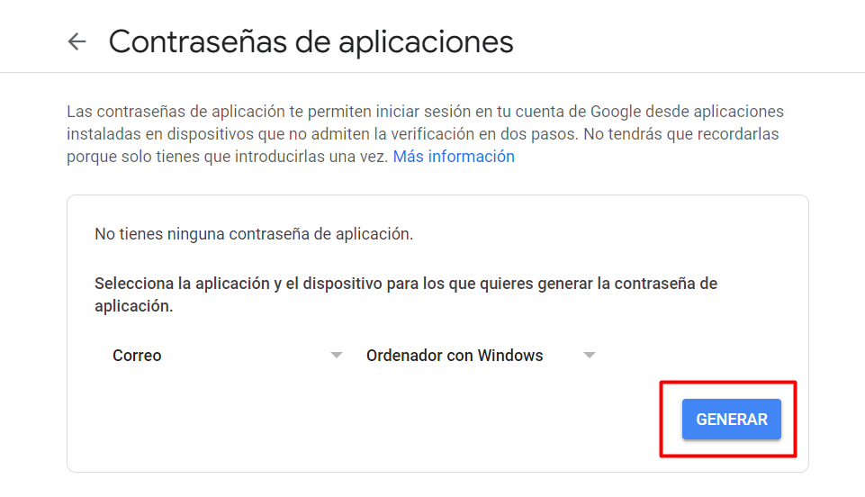

Este script hecho en Python envía un mensaje con la IP y el SO del dispositivo con a tu correo cada vez que alguien se conecta a la VPN de tu servidor Raspbian.
<br/>
El script se ejcuta continuamente a través de un servicio

# Configuración script
Edita el script de Python para configurarlo con los detalles de tu correo y las rutas necesarias
```
nano monitoreo_vpn.py
```
Crea una cuenta de Gmail que utilizarás sólo para enviar los correos.
<br/>
Sustituye la variable de destinatario por el correo en el que quieras recibir las alertas, la variable de emisor por el correo que vas a utilizar para enviar las alertas y la ruta del log por la ruta completa del archivo log de OpenVPN (En Debian y derivados suele ser /var/log/openvpn/openvpn.log)
<br/><br/>
Accede a los ajustes de la cuenta emisor de Gmail y asegurate de que la verificación en dos pasos está activada

<br/>

<br/><br/>
Para poder usar la contraseña, accede a <a href="https://myaccount.google.com/apppasswords">Contraseñas de aplicaciones</a>
<br/>

<br/>
Copia la clave generada en el valor de la variable password del script de envío.

# Instalación
Ahora se debe clonar el repositorio en el servidor VPN y ejecutar el instalador
```
git clone git@github.com:rxfatalslash/monitorizacion_vpn.git
cd monitorizacion_vpn/
sh installer.sh
```
Una vez ha terminado de ejcutarse el instalador ya estará instalado Python y configurados los archivos y el servicio