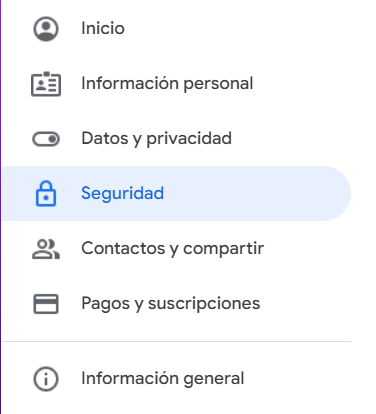

This Python script sends a message to your email with the IP and operating system details of the device whenever someone connects to the VPN of your Raspbian server.
<br/>
The script runs continuously through a service.

# Script configuration
Edit the Python script to configure it with your email details and necessary paths.
```
nano vpn_monitoring.py
```
Create a Gmail account that you will use exclusively for sending emails.
<br/>
Replace the recipient variable with the email where you want to receive alerts, the sender variable with the email you will use to send alerts, and the log path with the full path to the OpenVPN log file (typically /var/log/openvpn/openvpn.log on Debian and derivatives).
<br/><br/>
Access the settings of the sender Gmail account and ensure that two-step verification is enabled.

<br/>

<br/><br/>
To use the password, go to <a href="https://myaccount.google.com/apppasswords">App passwords</a>.
<br/>

<br/>
Copy the generated key into the password variable value in the sending script.

# Installation
Now, clone the repository on the VPN server and run the installer.
```
git clone git@github.com:rxfatalslash/vpn_monitoring.git
cd vpn_monitoring/
sh installer.sh
```
Once the installer has finished running, Python will be installed, and the files and service will be configured.